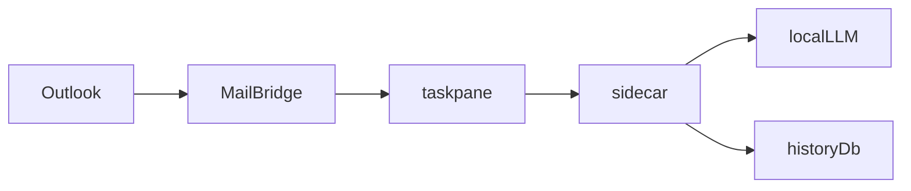

# アプリ整理の調査と第一波

KURU はすでに taskpane、sidecar、shared、Outlook COM に分かれている。この計画で実装するのは第一波だけ。呼び出し元のない関数を消し、同じ文言を一本化する。プロトコル、保存パス、`index.ts` の分割は扱わない。第二波は、第一波が全検査を通ったあとに別の計画として始める。

判断に使った原則は次のとおり。

- **Subtract Before You Add.** 足す前に、呼び出し元のない関数だけを消す。
- **Laziness Protocol.** 差分は 4 か所に限る。
- **Minimize Reader Load.** 読みにくい本体は `src/taskpane/index.ts`（約 93KB）。UI のテストが無いので今回は動かさない。
- **Prove It Works.** `npm test` だけでは合格にしない。型検査、画面の本番ビルド、配布サーバのバンドルも前後で通す。
- **Sequence Verifiable Units.** 1 か所消すごとに全検査を回し、通ってから次へ進む。

## 見直しで変えた点

初版から次の 4 点を変えた。

1. 戻す手段を足した。`c:\KURU` には git が無い（`git rev-parse` が失敗した）。このままでは失敗した削除を正確に戻せない。最初に git の初期コミットを作る。
2. 検査を足した。`vitest` は型を検査しない。`tsconfig.json` はテストを除外している。削除する 4 か所には直接のテストが無い。今回の削除を実際に見張るのは、`npm test` より型検査とビルドのほう。
3. 付随する削除を明記した。`notFound` を消すと `app.ts` 2 行目の `Request` の import が不要になる。`isPending` の再エクスポートを消すと `attach.ts` 5 行目の import も不要になる。
4. 推測に印を付けた。`hostModeFromItem` が `manifest.xml` 経路の名残というのは推測で、確認していない。

## 概要

Outlook クラシックの作業ウィンドウから、ローカル LLM と Argos でメール下書きを作るアプリ。Outlook の読み書きは C#、会話と LLM は Node、画面は TypeScript が持つ。

本番のホストは COM アドイン。`window.kuru` が `outlook/src/MailBridge.cs` に繋がる。画面の `src/taskpane/api.ts` は `https://127.0.0.1:28770` の sidecar を叩く。ブラウザは LLM にも SQLite にも直接触らない。

## 主要な概念

- `HostMode` は `compose`、`read`、`none`、`not-message`。判定の本番は C# の `MailGate`。
- 開いているメールの本文は C# の `MailBody.VisibleText` が平文にする。書き戻しの `bodyHtml` は HTML の前文。同じキー名で中身が違う。読み取りは `MailBridge.cs` 74 行、書き込みは 249 行。
- 接続ファイルは `%APPDATA%/LexCrew/connection.json`。`src/sidecar/connection.ts` 67 行のとおり、LexCrew-Doc が書いたファイルを起動時に上書きしない。履歴は `%APPDATA%/KURU/history.db`。
- 予定の上限は層ごとに違う。C# は最大 1500 件、予定一覧は 31 日で 40 件、空き時間は 14 日。

## 動き方

1. リボンが作業ウィンドウを開く。`Connect.cs` が `window.kuru` を注入し、`Sidecar.cs` がポート 28770 の Node を起動する。
2. 画面の `mount` が接続と設定と履歴を読む。
3. 送信は `deliver` から `src/taskpane/runTurn.ts` へ進む。sidecar の `/api/chat` が LLM に流す。
4. 下書き適用は先に `decideApply` が止め、通ったときだけ C# の `WriteDraft` が書く。

開発サーバは `src/server.ts`。配布物は `src/server.release.ts` を esbuild したもの。両方とも `createApp()` を使う。証明書、静的配信、ポート使用中の終了コードが違うので、1 ファイルにはまとめない。

## 置き場所

- 画面とツールループは `src/taskpane/`。
- HTTPS API、履歴、LLM、ICS は `src/sidecar/`。
- 予定、添付、プロンプト、フォントのルールは `src/shared/`。
- Outlook の実読み書きは `outlook/src/`。
- 配布の正本は `scripts/package.ps1` と `installer/`。`dist/` と `release/` は生成物で、`.gitignore` にある。
- `manifest.xml` は Office のウェブ アドイン用。107 行で `commands.html` を参照している。残す。

## 手順

### 0. 戻す手段を作る

`c:\KURU` で `git init` し、今の状態を初期コミットにする。

初期コミットの前に `.gitignore` へ次の 4 つを足す。どれもソースではない。

- `outlook/packages/`。NuGet の展開物で約 50MB。
- `outlook/nuget.exe`。約 8.7MB のツール本体。
- `installer/lexcrew.ico`。`package.ps1` が毎回作る。
- `sidecar.err`。実行時のログ。

既定ではこの 4 つを除外する。別のマシンで clone しても `package.ps1` をそのまま動かしたいなら、`outlook/packages/` と `nuget.exe` もコミットに含める。その場合は「含める」と指示する。

### 1. 基準を記録する

変更前に次の 4 つを実行し、結果を記録する。

- `npm test`
- `npx tsc --noEmit -p tsconfig.json`
- `npx webpack --mode production --devtool false`
- `npx esbuild src/server.release.ts --bundle --platform=node --target=node22 --external:better-sqlite3 --outfile=%TEMP%\kuru-server-check.js --log-level=warning`

esbuild のコマンドは `package.ps1` 31 行と同じ。出力先だけ一時フォルダに変え、`release/` は触らない。

型検査は、変更前から失敗している可能性がある。その場合はエラーの一覧を基準として保存する。変更後に、新しいエラーが 1 件も増えていないことを確認する。

### 2. 1 か所ずつ消す

各項目の前に、そのシンボルを `src` と `outlook` と `scripts` でもう一度検索する。本番の呼び出しが 0 件のときだけ消す。消したら手順 1 の 4 検査を回す。全部通ったら 1 コミットにする。通らなければ `git checkout` で戻し、その項目は見送る。

1. `src/sidecar/llm.ts` 161〜181 行の `postChat`。定義以外の参照は無い。`postUpstream` は 134 行でも使っているので残す。
2. `src/sidecar/app.ts` 332〜334 行の `notFound`。Express に登録されていない。2 行目の import から `Request` も外す。`Response` は 16 行で使っているので残す。
3. `src/taskpane/files/attach.ts` 35 行の `export { isPending };` と、5 行目の `isPending` の import。`index.ts` は `isPending` を `shared/attachedFiles` から読んでいる。`attach.ts` からは読んでいない。
4. `src/taskpane/files/ocr.ts` 84 行の文字列を、`src/shared/ocr.ts` の `EMPTY_SCAN_ERROR` に置き換える。import を 1 行足す。文面は「画像から文字を読み取れませんでした。」のまま変わらない。

### 3. 終わりの確認

手順 1 の 4 検査が、基準と同じか、基準より良い結果で通ること。4 件の削除それぞれにコミットがあること。消したシンボルを再検索し、参照が 0 件であること。

C# とインストーラは変えない。なので `package.ps1` の全体実行と、Outlook 上での手動確認は、この第一波の合格条件にしない。

## 第一波で残すもの

- `hostModeFromItem`。本番は未使用で、`shared.test.ts` だけが呼ぶ。`manifest.xml` 経路の名残だと推測しているが、確認していない。消すなら「消す」と指示する。
- `MailParty.SmtpAddress`。`MailParty.test.cs` だけが呼ぶ。送信検索は `SentSearch` の別の SMTP 正規化を使う。統合すると挙動が変わる可能性がある。
- 予定の未読文言 2 種。一覧は「予定表は読んでいません。」、空き時間は「候補は対応時間だけです。」を足した文。両方とも使われている。
- `%APPDATA%/LexCrew` と `%APPDATA%/KURU`。接続ファイルは LexCrew-Doc と共有している。
- `src/taskpane/index.ts`。分割の前に UI のテストが要る。
- `src/commands/commands.ts`。中身は空だが、webpack と `manifest.xml` が `commands.html` を参照している。
- `IRibbonControl`。Outlook の COM 定義で、消しても数行しか減らない。
- `outlook/src/LoadProbe.cs`。パッケージから除外された診断用の `Main`。
- `release/KURU-0.1.0.zip` と `KURU-Setup-0.1.0.exe`。9 月 27 日の古い生成物で、現行名は `LexCrew-Mail-*`。ソースではないので、この第一波では扱わない。

`bodyHtml` の改名、フォントサイズ検証を C# に足すこと、日時パーサの統一、予定上限の統一も扱わない。見た目は重複でも、挙動が変わる。

## 第二波の候補

値が今と同じものだけを 1 か所へ寄せる候補。どれも第一波には入れない。

- Argos の既定 URL `http://127.0.0.1:17890`。定数、`remote.ts`、`index.ts` のプレースホルダの 3 か所にある。
- 検索ヒット上限 5。定数と、`runTurn.ts` のウェブ検索の `slice(0, 5)` にある。
- LLM の base URL の正規化。`llm.ts` 42 行と `app.ts` 301 行にある。
- 予定プリセットの配列。`calendarEvents.ts` と `tools.ts` の enum にある。
- ローカル日時の同じ正規表現。`app.ts` の `parseRange` と `freeSlots.ts` の `parseLocal` にある。ICS の `Date.parse` とは意味が違うので、日時解釈の全面統一には含めない。
