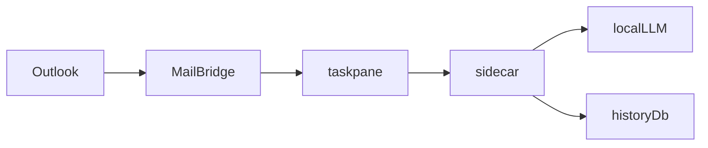

# アプリ整理の計画

KURU はすでに taskpane、sidecar、shared、Outlook COM に分かれている。第一波では、呼び出し元のない関数を消し、同じ文言を一本化した（実装済み）。第二波では、値も動きも同じ重複だけを 1 か所へ寄せる（未着手）。プロトコル、保存パス、`index.ts` の分割はどちらでも扱わない。

判断に使った原則は次のとおり。

- **Subtract Before You Add.** 足す前に、呼び出し元のない関数だけを消す。
- **Laziness Protocol.** 差分は 4 か所に限る。
- **Minimize Reader Load.** 読みにくい本体は `src/taskpane/index.ts`（約 93KB）。UI のテストが無いので今回は動かさない。
- **Prove It Works.** `npm test` だけでは合格にしない。型検査、画面の本番ビルド、配布サーバのバンドルも前後で通す。
- **Sequence Verifiable Units.** 1 か所消すごとに全検査を回し、通ってから次へ進む。

## 見直しで変えた点

初版から次の 4 点を変えた。

1. 戻す手段を足した。`c:\KURU` には git が無い（`git rev-parse` が失敗した）。このままでは失敗した削除を正確に戻せない。最初に git の初期コミットを作る。
2. 検査を足した。`vitest` は型を検査しない。`tsconfig.json` はテストを除外している。削除する 4 か所には直接のテストが無い。今回の削除を実際に見張るのは、`npm test` より型検査とビルドのほう。
3. 付随する削除を明記した。`notFound` を消すと `app.ts` 2 行目の `Request` の import が不要になる。`isPending` の再エクスポートを消すと `attach.ts` 5 行目の import も不要になる。
4. 推測に印を付けた。`hostModeFromItem` が `manifest.xml` 経路の名残というのは推測で、確認していない。

## 第一波の結果

第一波は 2026-09-29 に実装した。コミットは次の 5 つ。

```
6f5aa9a Use EMPTY_SCAN_ERROR for empty OCR scan failures.
22ec6d4 Drop redundant isPending re-export from attach.
45844a3 Remove unregistered notFound handler from sidecar app.
f27bb87 Remove unused postChat from sidecar llm.
ac79b8f Initial commit before refactor wave 1.
```

基準（変更前）と最終状態は同じ結果だった。テスト 132 件成功、型検査エラー 0 件、webpack 本番ビルド成功、esbuild バンドル成功。消した 3 つのシンボルの参照は、リポジトリ内で 0 件。

### 再確認で見つかった点

- **検査の順序が計画と違った.** 実装時は 4 か所を全部直してから 1 回だけ検査し、その後に 4 つへ分けてコミットした。再確認で途中の 3 コミットを 1 つずつ checkout し、型検査とテストを回した。3 つとも型検査エラー 0 件、テスト 132 件成功だった。webpack と esbuild は途中コミットでは回していない。4 つの差分は別々のファイルなので、途中だけが壊れる経路は無いと推測している（未確認）。
- **初期コミットに生成物と一時ファイルが入った.** `outlook/bin/` の dll と exe 6 個と、`.tmp_exports.csv` の 2 種類。`.tmp_exports.csv` は `src` の export 一覧（Name, File, Line, Kind）で、以前の調査で作られた一時ファイルと推測している。どちらもリポジトリ内のどこからも参照されていない。`package.ps1` も `outlook/bin` を使わない。
- **型検査は `scripts/` を見ていない.** `tsconfig.json` の `include` は `src/**/*` だけ。`scripts/measure-replay.ts` は `src/sidecar/history.ts` の `historyPath` を import している。第1波の削除はこのファイルに触れていない（grep で確認）。ただ、第二波で export を変える場合は検査が要る。
- **インストール済みのアプリは古いまま.** `release/` は変えていない。変更がユーザーに届くのは `npm run package` で作り直したあと。Outlook 上での手動確認もまだしていない。`dist/` は検査の webpack で作り直された（生成物、`clean: true`）。

## 概要

Outlook クラシックの作業ウィンドウから、ローカル LLM と Argos でメール下書きを作るアプリ。Outlook の読み書きは C#、会話と LLM は Node、画面は TypeScript が持つ。

本番のホストは COM アドイン。`window.kuru` が `outlook/src/MailBridge.cs` に繋がる。画面の `src/taskpane/api.ts` は `https://127.0.0.1:28770` の sidecar を叩く。ブラウザは LLM にも SQLite にも直接触らない。



## 主要な概念

- `HostMode` は `compose`、`read`、`none`、`not-message`。判定の本番は C# の `MailGate`。
- 開いているメールの本文は C# の `MailBody.VisibleText` が平文にする。書き戻しの `bodyHtml` は HTML の前文。同じキー名で中身が違う。読み取りは `MailBridge.cs` 74 行、書き込みは 249 行。
- 接続ファイルは `%APPDATA%/LexCrew/connection.json`。`src/sidecar/connection.ts` 67 行のとおり、LexCrew-Doc が書いたファイルを起動時に上書きしない。履歴は `%APPDATA%/KURU/history.db`。
- 予定の上限は層ごとに違う。C# は最大 1500 件、予定一覧は 31 日で 40 件、空き時間は 14 日。

## 動き方

1. リボンが作業ウィンドウを開く。`Connect.cs` が `window.kuru` を注入し、`Sidecar.cs` がポート 28770 の Node を起動する。
2. 画面の `mount` が接続と設定と履歴を読む。
3. 送信は `deliver` から `src/taskpane/runTurn.ts` へ進む。sidecar の `/api/chat` が LLM に流す。
4. 下書き適用は先に `decideApply` が止め、通ったときだけ C# の `WriteDraft` が書く。

開発サーバは `src/server.ts`。配布物は `src/server.release.ts` を esbuild したもの。両方とも `createApp()` を使う。証明書、静的配信、ポート使用中の終了コードが違うので、1 ファイルにはまとめない。

## 置き場所

- 画面とツールループは `src/taskpane/`。
- HTTPS API、履歴、LLM、ICS は `src/sidecar/`。
- 予定、添付、プロンプト、フォントのルールは `src/shared/`。
- Outlook の実読み書きは `outlook/src/`。
- 配布の正本は `scripts/package.ps1` と `installer/`。`dist/` と `release/` は生成物で、`.gitignore` にある。
- `manifest.xml` は Office のウェブ アドイン用。107 行で `commands.html` を参照している。残す。

## 手順

### 0. 戻す手段を作る

`c:\KURU` で `git init` し、今の状態を初期コミットにする。

初期コミットの前に `.gitignore` へ次の 4 つを足す。どれもソースではない。

- `outlook/packages/`。NuGet の展開物で約 50MB。
- `outlook/nuget.exe`。約 8.7MB のツール本体。
- `installer/lexcrew.ico`。`package.ps1` が毎回作る。
- `sidecar.err`。実行時のログ。

既定ではこの 4 つを除外する。別のマシンで clone しても `package.ps1` をそのまま動かしたいなら、`outlook/packages/` と `nuget.exe` もコミットに含める。その場合は「含める」と指示する。

### 1. 基準を記録する

変更前に次の 4 つを実行し、結果を記録する。

- `npm test`
- `npx tsc --noEmit -p tsconfig.json`
- `npx webpack --mode production --devtool false`
- `npx esbuild src/server.release.ts --bundle --platform=node --target=node22 --external:better-sqlite3 --outfile=%TEMP%\kuru-server-check.js --log-level=warning`

esbuild のコマンドは `package.ps1` 31 行と同じ。出力先だけ一時フォルダに変え、`release/` は触らない。

型検査は、変更前から失敗している可能性がある。その場合はエラーの一覧を基準として保存する。変更後に、新しいエラーが 1 件も増えていないことを確認する。

### 2. 1 か所ずつ消す

各項目の前に、そのシンボルを `src` と `outlook` と `scripts` でもう一度検索する。本番の呼び出しが 0 件のときだけ消す。消したら手順 1 の 4 検査を回す。全部通ったら 1 コミットにする。通らなければ `git checkout` で戻し、その項目は見送る。

1. `src/sidecar/llm.ts` 161〜181 行の `postChat`。定義以外の参照は無い。`postUpstream` は 134 行でも使っているので残す。
2. `src/sidecar/app.ts` 332〜334 行の `notFound`。Express に登録されていない。2 行目の import から `Request` も外す。`Response` は 16 行で使っているので残す。
3. `src/taskpane/files/attach.ts` 35 行の `export { isPending };` と、5 行目の `isPending` の import。`index.ts` は `isPending` を `shared/attachedFiles` から読んでいる。`attach.ts` からは読んでいない。
4. `src/taskpane/files/ocr.ts` 84 行の文字列を、`src/shared/ocr.ts` の `EMPTY_SCAN_ERROR` に置き換える。import を 1 行足す。文面は「画像から文字を読み取れませんでした。」のまま変わらない。

### 3. 終わりの確認

手順 1 の 4 検査が、基準と同じか、基準より良い結果で通ること。4 件の削除それぞれにコミットがあること。消したシンボルを再検索し、参照が 0 件であること。

C# とインストーラは変えない。なので `package.ps1` の全体実行と、Outlook 上での手動確認は、この第一波の合格条件にしない。

## 第一波で残すもの

- 予定の未読文言 2 種。一覧は「予定表は読んでいません。」、空き時間は「候補は対応時間だけです。」を足した文。両方とも使われている。
- `%APPDATA%/LexCrew` と `%APPDATA%/KURU`。接続ファイルは LexCrew-Doc と共有している。
- `src/taskpane/index.ts`。分割の前に UI のテストが要る。
- `src/commands/commands.ts`。中身は空だが、webpack と `manifest.xml` が `commands.html` を参照している。
- `IRibbonControl`。Outlook の COM 定義で、消しても数行しか減らない。
- `outlook/src/LoadProbe.cs`。パッケージから除外された診断用の `Main`。
`hostModeFromItem`、`MailParty.SmtpAddress`、`release/KURU-*` も第一波では残した。後の掃除で、ユーザー指示により削除した。

`bodyHtml` の改名、フォントサイズ検証を C# に足すこと、日時パーサの統一、予定上限の統一も扱わない。見た目は重複でも、挙動が変わる。

## 第二波の計画

値も動きも今と同じものだけを、1 か所へ寄せる。ユーザーに見える文言、LLM に送る JSON、HTTP の応答は 1 バイトも変えない。

### 検査

第1波の 4 検査に、ツール定義の JSON 比較を足す。最終状態で 5 つ全部を回す。各コミットが単独で通ることは、`git rebase --exec` で型検査とテストを全コミットに自動でかけて確かめる（「第二波の結果」を参照）。

1. `npm test`
2. `npx tsc --noEmit -p tsconfig.json`
3. `npx webpack --mode production --devtool false`
4. `npx esbuild src/server.release.ts ...`（第1波と同じ、一時フォルダへ出力）
5. ツール定義の JSON 比較。`buildTools({ searxng: true, argos: true })` と `buildTools({ searxng: false, argos: false })` を `JSON.stringify` した結果を、変更前に一時ファイルへ保存する。変更後の出力と完全一致すること。LLM に送るツール定義が変わっていないことを確かめる。

### 0. git の後始末

`.gitignore` に `outlook/bin/` と `.tmp_exports.csv` を足し、追跡から外す。実施内容は「掃除」を参照。

### 1. Argos の既定 URL

`http://127.0.0.1:17890` はソースに 4 回出てくる。`constants.ts` 46 行の定義と、`api.ts` 79 行、`app.ts` 180 行・196 行の利用は、すでに `DEFAULT_ARGOS_BASE_URL` を使っている。直書きは次の 2 か所。

- `src/sidecar/remote.ts` 2 行の `normalizeBase` の既定値。接続確認の `probeArgos`（`app.ts` 325 行）は空の URL をそのまま渡すので、この既定値は使われている。定数の import に置き換える。
- `src/taskpane/index.ts` 933 行の入力欄プレースホルダ。定数に置き換える。表示は同じ。

### 2. LLM の base URL の正規化

`request.llmBaseUrl.replace(/\/+$/, "").replace(/\/v1$/, "")` が `llm.ts` 41 行と `app.ts` 301 行（`probeLlm`）にある。どちらも trim しない点まで同じ。`llm.ts` に `llmRoot(baseUrl)` を 1 つ export し、両方がそれを呼ぶ。

`llm.test.ts` に、期待値を直書きしたテストを足す。`"http://h:8000/v1/"` は `"http://h:8000"`、`"http://h:8000"` はそのまま。

### 3. 予定プリセットの配列

`EVENT_PRESETS`（`calendarEvents.ts` 3 行）と `tools.ts` 46 行の enum は、同じ 4 つが同じ順で並んでいる。`tools.ts` は `calendarEvents` をすでに import している。enum を `[...EVENT_PRESETS]` にする。検査 5 の JSON 比較で、出力が変わらないことを確かめる。

### 4. ローカル日時の解釈

`app.ts` 42 行の `parseRange` と `freeSlots.ts` 210 行の `parseLocal` は、中身が 1 文字も違わない。`parseLocal` を export し、`app.ts` はそれを使い、`parseRange` を消す。

`/api/calendar/ical` の範囲指定にはテストが無い。先に `parseLocal` のテストを足す。`"2026-09-29T09:30"` は 2026 年 9 月 29 日 9 時 30 分のローカル時刻、`"2026-09-29"` は `null`。

## 第二波から外したもの

- **ウェブ検索の `slice(0, 5)`.** 初版は `MAX_HITS_FOR_MODEL` に寄せる案だった。コードを読むと、`runTurn.ts` 114 行は SearXNG のウェブ検索の件数で、`MAX_HITS_FOR_MODEL` は Argos の件数だった（`argos.ts` 38 行）。値が同じ 5 でも別の上限なので、寄せると片方を変えたときにもう片方も動いてしまう。1 か所だけの数値なので、定数にもしない。
- **`startOfDay` と `addDays`.** 同じ 1 行の関数が、`calendarEvents.ts`、`freeSlots.ts`、`ical.ts` の 3 か所に private である。寄せると 1 行のためにモジュール間の依存が増えるので、やらない。
- **内部だけで使う export を外すこと.** `stripThinking`、`defaultSlotQuery`、`loadAppointments`、`imageDataUrl`、`foreignCharNotice`、`conversationTitle`、`setKeepConnectionInStorage` は同じファイルの中からしか呼ばれていない。得られるものが小さいので、やらない。
- **ホスト側の `JSON.parse` 二重呼び出し.** `host.ts` の 2 か所。`host.ts` にはテストが無く、C# の非同期呼び出しの戻り方に依存する。やらない。

## 掃除（2026-09-29、第二波の前）

ユーザー指示で削除した。

- `.tmp_exports.csv`（ディスクと git 追跡）
- `hostModeFromItem` とそのテスト
- `MailParty.SmtpAddress` とそのテスト
- `scripts/measure-replay.ts`、`tools/generate-icons.py`
- `release/KURU-0.1.0.zip`、`release/KURU-Setup-0.1.0.exe`（`release/KURU/` ステージと `LexCrew-Mail-*` は残す）

`.gitignore` に `.tmp_exports.csv` と `outlook/bin/` を足し、`outlook/bin` と `.tmp_exports.csv` を追跡から外した。

## 第二波の結果

2026-09-29 に実装した。コミットは掃除と、第二波の 4 つ。

```
6c8217a Export parseLocal and reuse it for calendar range parsing.
2eaea4e Derive list_events preset enum from EVENT_PRESETS.
5a73ec5 Share llmRoot for LLM base URL normalization.
cb7a79b Use DEFAULT_ARGOS_BASE_URL for Argos fallbacks and placeholder.
05e1c06 Remove unused exports, scripts, and tracked build artifacts.
```

最終状態の検査結果は次のとおり。テスト 133 件成功、型検査エラー 0 件、webpack 本番ビルド成功、esbuild バンドル成功、ツール定義の JSON は変更前と完全一致。C# はアドイン DLL のコンパイルと `MailParty` のテストが通った。

### 履歴の作り直し

最初の実装では、全部を直して 1 回だけ検査し、あとからファイル単位でコミットに振り分けた。その結果、途中の 5 コミット中 4 つが壊れていた。`hostModeFromItem` のテスト削除が最後のコミットに入り、`app.ts` の `parseLocal` の変更が `llmRoot` のコミットに混ざっていた。

まだ誰とも共有していないローカルのリポジトリなので、第1波の最後（`6f5aa9a`）の上に積み直した。元の履歴は `backup/wave2-before-rewrite` ブランチに残している。作り直した履歴のコードは、元の最終状態と 1 バイトも違わない（`git diff` で確認）。比較用に使った `docs/wave2-tools-baseline.json` は、どのスクリプトも読まないのでコミットから外した。

全コミットが単独で通ることは、`git rebase --exec "npx tsc --noEmit -p tsconfig.json && npx vitest run"` で確かめた。今後の整理でも同じ方法を使う。
